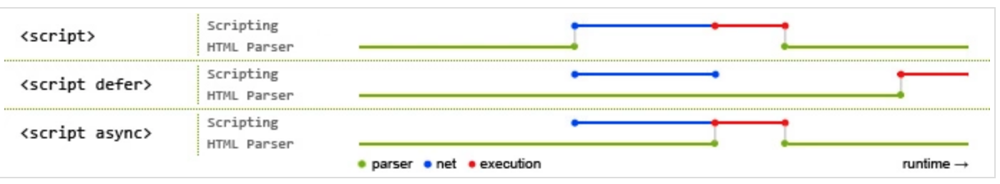

## CSS

### 1. 盒模型
* content-box：w3c标准盒模型 **width = content**
* border-box: IE盒模型 **width = border + padding + content**
* padding-box: **width = padding + content**
* margin-box: 浏览器未实现，猜测**width = margin + border + padding + content**

### 2. BFC
Block Format Context（块级格式化上下文），CSS世界的结界，是一个独立的渲染区域，处于 BFC 内部的元素与外部的元素相互隔离，使内外元素的定位不会相互影响。

IE下为 Layout，可通过 zoom:1 触发

* 触发条件
	* 根元素 html
	* position: absolute/fixed
	* display: inline-block/table-cell/table-caption
	* float: 非none
	* overflow: 非visible

* 规则
	* 属于同一个BFC的两个相邻Box垂直排列
	* 属于同一个BFC的两个相邻Box的margin会重叠
	* BFC中子元素的margin box的左边，与包含块（BFC）border-box的左边相接触（子元素absolute除外）
	* BFC的区域不会与float的元素区域重叠
	* 计算BFC的高度时候，浮动子元素也参与计算
	* 文字层不会被浮动层覆盖，会环绕于周围
	
* 应用
	* 阻止margin重叠
	* 可以包含浮动元素 - 清除内部浮动（清除浮动的原理是两个div都位于同一个BFC中）
	* 自适应两栏布局
	* 可以阻止元素被浮动元素覆盖

	
### 3. 层叠上下文
元素提升为一个比较特殊的图层，在三维空间的z轴高出普通元素一等

* 触发条件
	* 根元素 html
	* position
	* css属性
		* flex
		* transform
		* opacity
		* filter
		* will-change
		* -webkit-overflow-scrolling
		* z-index
* 层叠等级
	* 在同一层叠上下文中，层叠等级才有意义
	* z-index优先级最高

	
	
### 4. 居中布局
* 水平居中
	* 行内元素 text-align: center
	* 块级元素 margin: 0 auto 要设置宽度
	* absolute + transform translateX
	* flex + justify-content: center
* 垂直居中
	* 行内元素 line-height: hright
	* absolute + transform translateY
	* flex + align-items: center
	* table
* 水平垂直居中
	* absolute + transform
	* flex + justify-content + align-items

	
### 5. 选择器优先级

* !important > 行内样式 > #id > .class(:伪类) > tag > * > 继承 > 默认
* 选择器是**从右到左**解析，因此要少用通配符和标签选择器

### 6. 去除浮动，防止父级塌陷
* 增加尾元素清除浮动
	* :after
	* <br>
	* clear: both
* 创建父级BFC
* 父级设置高度

### 7. link与@import区别
* **link**功能较多，可以定义rss、rel等属性，而**@import**只能加载css
* 当解析到**link**时候，页面是同步加载所引的css，而**@import**所引的css会等到页面加载完才被加载
* **link**没有兼容性问题，**@import**有兼容性问题，要IE5以上才能用
* **link**可以使用js动态引入，**@import**不行

### 8. CSS预处理器（Sass/Less/Stylus）
* 变量：就像其他编程语言一样，免于多处修改。
	* Sass：使用「$」对变量进行声明，变量名和变量值使用冒号进行分割
	* Less：使用「@」对变量进行声明
	* Stylus：中声明变量没有任何限定，结尾的分号可有可无，但变量名和变量值之间必须要有『等号』。但需要注意的是，如果用“@”符号来声明变量，Stylus会进行编译，但不会赋值给变量。就是说，Stylus 不要使用『@』声明变量。Stylus 调用变量的方法和Less、Sass完全相同。

* 作用域：有了变量，就必须得有作用域进行管理。就想js一样，它会从局部作用域开始往上查找变量。
	* Sass：它的方式是三者中最差的，不存在全局变量的概念
	* Less：它的方式和js比较相似，逐级往上查找变量
	* Stylus：它的方式和Less比较相似，但是它和Sass一样更倾向于指令式查找

* 嵌套：对于css来说，有嵌套的写法无疑是完美的，更像是父子层级之间明确关系
	* 三者在这处的处理都是一样的，使用「&」表示父元素

### 9. 动画
* translate
* scale
* rotate
* skew
* opacity
* color


## Javascript

### 1. js加载
* 普通加载：浏览器会立即加载并执行指定的脚本，“立即”指的是在渲染该 script 标签之下的文档元素之前，也就是说不等待后续载入的文档元素，读到就加载并执行
* defer：加载后续文档元素的过程将和 script.js 的加载并行进行（异步），但是 script.js 的执行要在所有元素解析完成之后，DOMContentLoaded 事件触发之前完成（defer是顺序执行的）
* async:加载和渲染后续文档元素的过程将和 script.js 的加载并行执行，该js加载完成会**立即执行**（因此async不保证执行顺序），执行该js会阻塞渲染和解析后续文档

蓝色线代表网络读取，红色线代表执行时间，这俩都是针对脚本的；绿色线代表 HTML 解析。


### 2. 原型 Prototype
* 只有**函数**才有prototype属性，通过构造函数生成的实例具有__proto__属性，该属性指向其构造函数的prototype

```
function Person(name) {
	this.name = name;
}
var p1 = new Person('xiaoli');
p1.__proto__ === Person.prototype; // true
Person.prototype.constructor === Person; // true
p1.__proto__.constructor === Person; // true
```

### 3. new
上面的示例中：

```
function Person(name) {
	this.name = name;
}
var p1 = new Person('xiaoli');
```

等同于

```
var p1 = {};
p1.__proto__ = Person.prototype;
Person.call(p1, 'xiaoli');
```

### 4. 类型转换
* -、*、/、% ：一律转换成数值后计算
* +：
	* 数字 + 字符串 = 字符串， 运算顺序是从左到右
	* 数字 + 对象， 优先调用对象的valueOf -> toString
	* 数字 + boolean/null -> 数字
	* 数字 + undefined -> NaN
* [1].toString() === '1'
* {}.toString() === '[object object]'
* NaN !== NaN


## Webpack

### 1. hash chunkhash contenthash
* **hash**是工程级别的，即每次修改任何一个文件，所有文件的hash至都会改变。因此一旦修改了任何一个文件，整个工程的文件缓存都会失效（每个压缩后的文件的hash值是一样的，所以对于没有改变的模块而言，这样做显然不恰当，因为缓存失效了）。
* **chunkhash**根据不同的入口文件（Entry）进行以来文件解析、构建对应的chunk、生成对应的hash值（每个chunk模块的hash值不一样）。在生产环境中把一些公共库和程序入口文件区分开，单独打包构建，接着我们采用contenthash的方式生成hash值，那么只要不改动公共库的代码，就可以保证其hash值不受影响就可以缓存了。但是这样又有一个问题，在同一个模块中，因为我们是将样式作为模块import到JavaScript文件中的，所以它们的chunkhash是一致的，此时如果只修改js，对应的css和js的hash值都改变，但css文件的内容并没有改变，所以又没有利用到缓存；如果只修改了css是不会参与chunkhash计算的，也不会作为独立的chunk计算，所以name和hash还是取得js的，那么由于chunkhash没变，导致浏览器使用了缓存，使得新改的css没有及时出效果，于是又有了**contenhash**。
* **contenthash**是针对内容级别的，只有模块的内容变了，与之关联的hash值才会改变。

感觉就是循序渐进的关系！

在项目中，通常做法是把项目中css都抽离出对应的css文件来加以引用（css文件最好使用contenthash）。